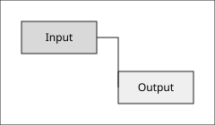

# Assets

## Local Previews

### Files
- [ ] SVG preview sample
  
- [ ] CSV preview sample
  
- [ ] Raw Excalidraw preview sample
  
- [ ] Draw.io preview sample
  

### Includes
- [ ] Include preview sample
  !!!include(assets/include-snippet.md)!!!

## Mixed Content

### References
- [ ] Regular markdown link sample [Fixture notes](assets/include-snippet.md)
- [ ] Plain asset path for path-fix testing assets/sample.svg
